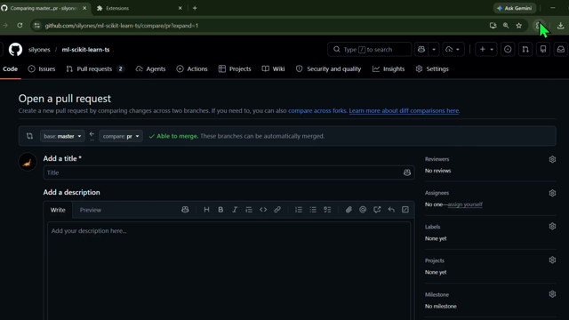

# PR Helper

> Open-source Chrome extension that auto-generates GitHub PR titles, descriptions, and testing checklists from your diff.

PR Helper is free to use, easy to self-host, and built for developers who want to spend less time writing PR boilerplate and more time shipping code.

## Demo

[](steps%20to%20use.mp4)

Click the image above to open the full walkthrough video on GitHub.

## Features

- Reads your GitHub PR diff automatically
- Generates PR title, description, and testing checklist
- Generates conventional commit message
- One-click fill into the GitHub PR form
- Works on Chrome, Brave, and Edge
- No build step — load unpacked and go

## Why Groq?

Right now, PR Helper uses the [Groq API](https://console.groq.com) because it is **free and fast** — a great fit for a small extension that needs quick responses without running your own backend.

The integration lives in `background.js` and is intentionally simple. If you prefer **OpenAI**, **Anthropic**, **Gemini**, or a **local model**, you are welcome to:

- **Open an issue** with a suggestion for another provider
- **Open a pull request** with an alternative LLM integration

Contributions that add provider support (or make the provider configurable) are especially welcome.

## Installation

### From source (developer mode)

1. Clone this repo

```bash
git clone https://github.com/silyones/PR-helper-extension.git
```

2. Open Chrome and go to `chrome://extensions`
3. Enable **Developer mode** (top-right toggle)
4. Click **Load unpacked** and select this repository folder
5. The PR Helper icon will appear in your toolbar

## Setup

1. Get a free Groq API key at [console.groq.com](https://console.groq.com)
2. Click the PR Helper extension icon
3. Paste your API key and click **Save** (the input border turns green when saved)

## Usage

1. Go to any GitHub repository
2. Open a pull request or create a new one
3. Click the PR Helper extension icon
4. Click **Generate PR description**
5. Review the auto-filled title and description, then submit

See the demo video above for a full walkthrough.

## Tech stack

- Vanilla JavaScript (no React, no npm, no build step)
- Chrome Extension Manifest V3
- Groq API (Llama 3.3 70B)
- GitHub DOM API

## Contributing

This project is open source and I would love to collaborate.

Ways to help:

- Report bugs or request features via [GitHub Issues](https://github.com/silyones/PR-helper-extension/issues)
- Suggest or add support for other LLM providers
- Improve diff parsing as GitHub’s UI changes
- Polish the popup UI or documentation

Pull requests are welcome. If you are unsure where to start, open an issue and we can figure it out together.

## License

MIT
